# 🌄 Auto Wallpaper Changer (Windows)  

[](https://opensource.org/licenses/MIT)  
[](https://www.python.org/downloads/)  
[](https://www.wallwidgy.me/)  

## 📌 Overview  
This **Windows-exclusive** wallpaper changer fetches high-quality wallpapers from **WallWidgy API** and updates your desktop background automatically. The script ensures **no repetition**, downloads wallpapers to a dedicated folder, and runs **automatically using Task Scheduler**.  

## 🚀 Features  
✅ Fetches random wallpapers from **WallWidgy API**  
✅ Prevents repetition with a **history tracker**  
✅ **Automatically updates Windows wallpaper**  
✅ **Runs on startup using Task Scheduler**  
✅ Logs all actions for easy debugging  

---

## 🛠 Installation  

### 1️⃣ Clone the Repository  
```bash
git clone https://github.com/asifahamed11/auto-wallpaper-changer.git
cd auto-wallpaper-changer
```

### 2️⃣ Install Dependencies  
Ensure you have Python **3.6+** installed. Then, install the required library:  
```bash
pip install -r requirements.txt
```

### 3️⃣ Run the Script  
```bash
python wallpaper_changer.py
```

---

## 🔄 Automate Using Windows Task Scheduler  

To make the wallpaper changer **run automatically**, follow these steps:  

### **Step 1: Open Task Scheduler**  
Press **Win + R**, type `taskschd.msc`, and press **Enter**.  

  

### **Step 2: Create a Basic Task**  
Click **Create Basic Task...** in the right-hand panel.  

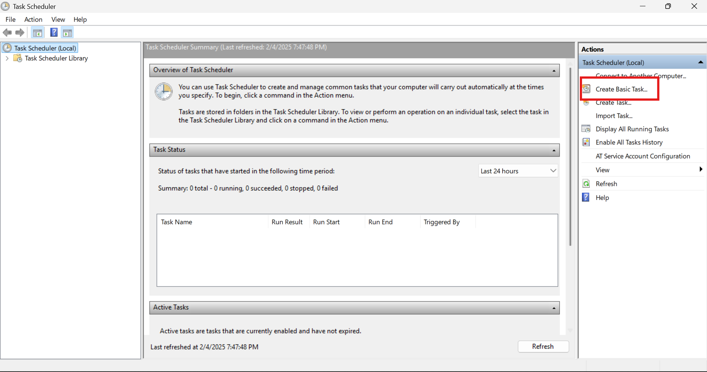  

### **Step 3: Name the Task**  
- Name: **Wallpaper Changer**  
- Description: **Updates desktop wallpaper automatically**  
- Click **Next**  

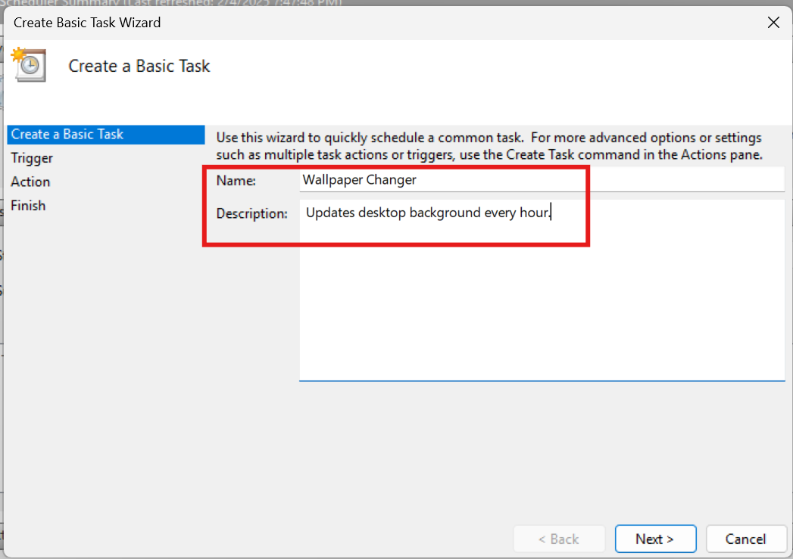  

### **Step 4: Set the Trigger**  
- Select **Daily**, click **Next**  
- Set **Start Time** (e.g., `7:50 PM`)  
- Select **Recur every: 1 days**, click **Next**  

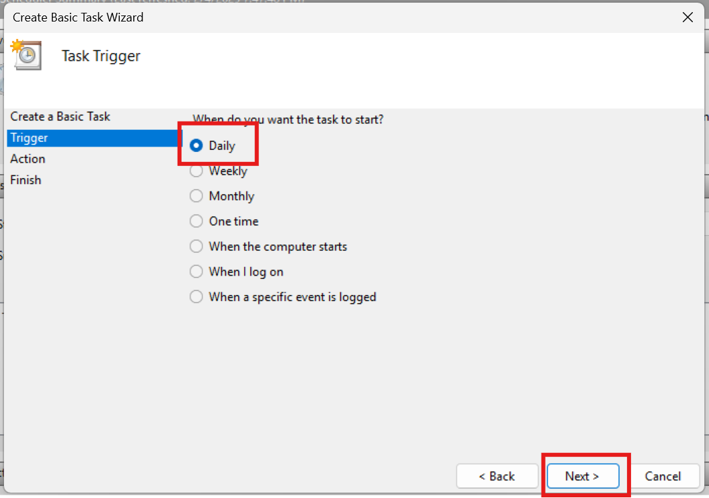  

### **Step 5: Set the Action**  
- Select **Start a program**, click **Next**  
- Browse to `run_wallpaper_changer.bat` (e.g., `C:\Users\Admin\Pictures\WALL\run_wallpaper_changer.bat`)  
- Click **Next**  

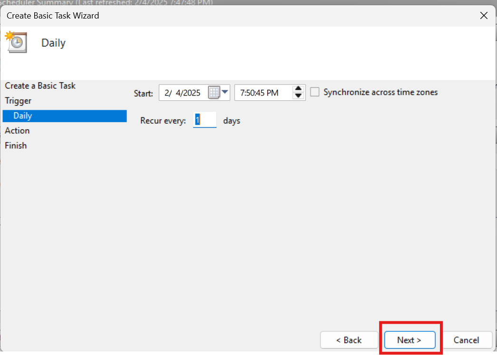  

### **Step 6: Review and Finish**  
Check **Open Properties when I click Finish**, then click **Finish**  

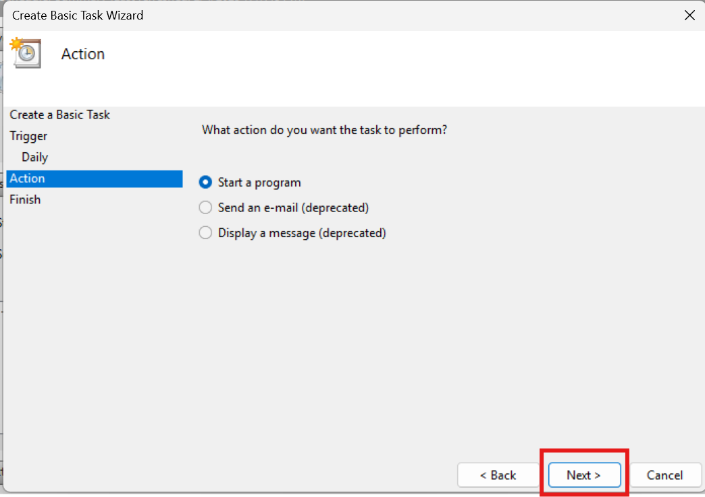  

### **Step 7: Modify Task Properties**  
- Find the task in **Task Scheduler Library**  
- Right-click and select **Properties**  

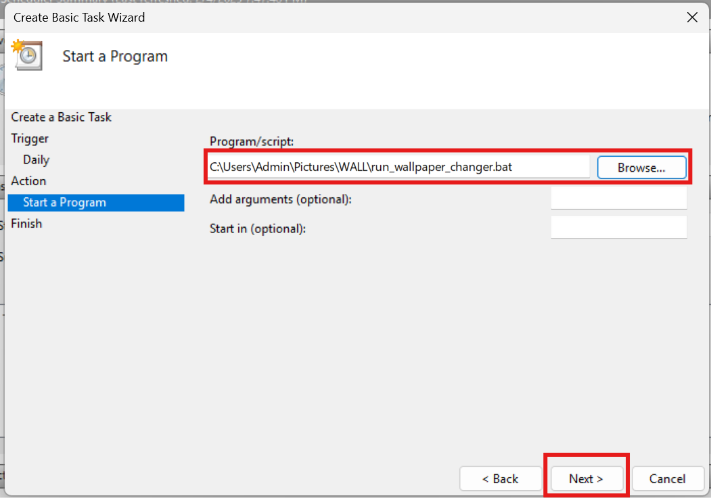  

### **Step 8: Configure Triggers**  
- Go to **Triggers** → Click **Edit**  
- Set **Repeat task every: 1 hour**  
- Set **Duration: Indefinitely**  

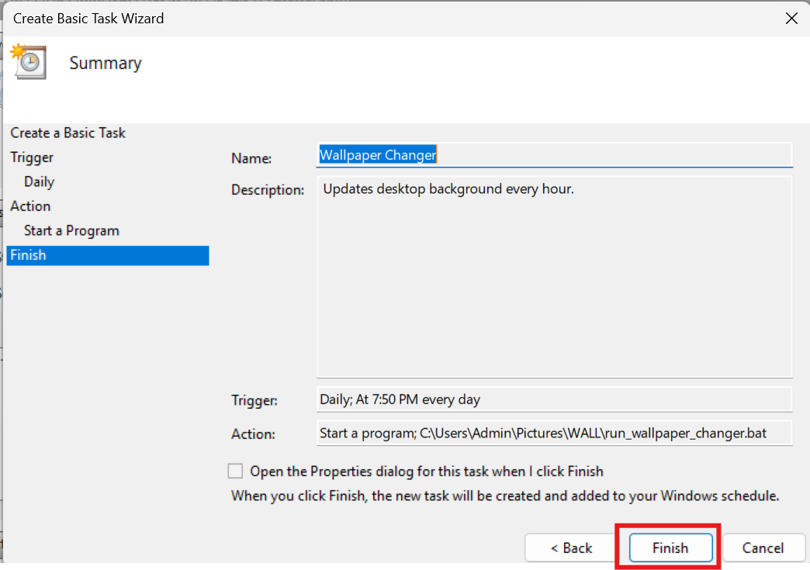  

### **Step 9: Configure Power Settings**  
- Go to **Conditions**  
- Enable **Start only if the computer is on AC power**  

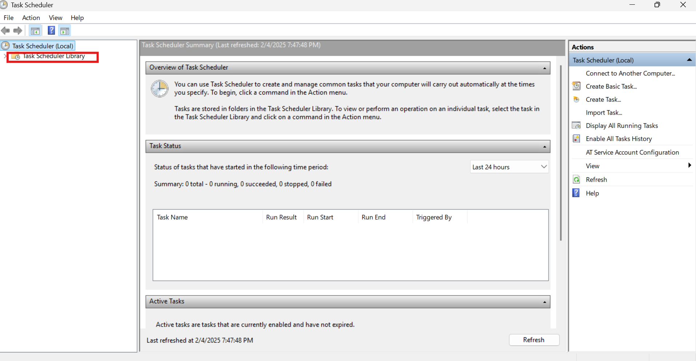  

### **Step 10: Grant Administrator Privileges**  
- Go to **General**  
- Check **Run with highest privileges**  

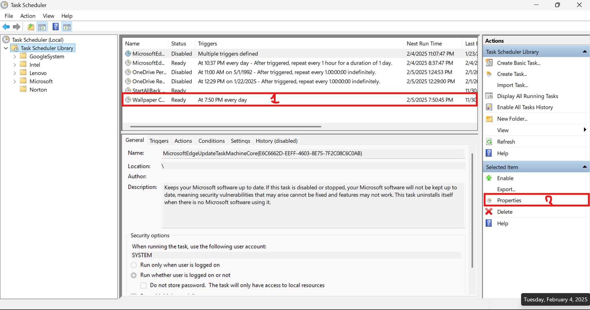  

### **Step 11: Verify Task in Task Scheduler**  
Check if **Wallpaper Changer** appears in **Task Scheduler Library**  

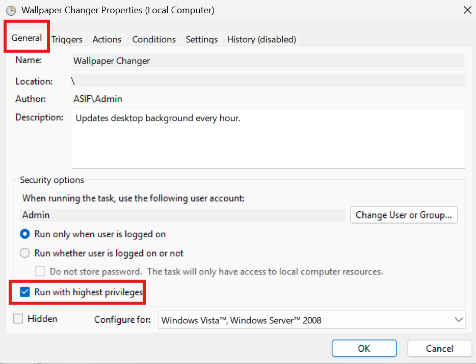  

### **Step 12: Run the Task to Test**  
Right-click the task → Select **Run**  

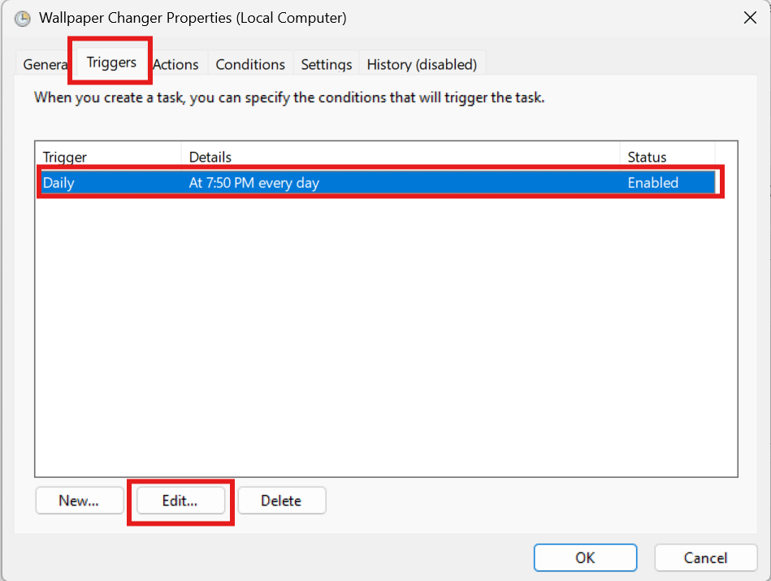  

---

## ⚙️ How It Works  
1. The script initializes and creates necessary directories:  
   📂 **Wallpapers Folder:** `C:\Users\Admin\WallwidgyWallpapers\images\`  
   📂 **Logs Folder:** `C:\Users\Admin\WallwidgyWallpapers\logs\`  
2. Fetches a **random, unused wallpaper** from **WallWidgy API**.  
3. Downloads and saves it locally.  
4. Updates the **Windows wallpaper** using:  
   ```python
   ctypes.windll.user32.SystemParametersInfoW(20, 0, file_path, 3)
   ```
5. Logs all changes in:  
   ```txt
   C:\Users\Admin\WallwidgyWallpapers\logs\wallpaper_changer.log
   ```

---

## 🔧 Configuration  
Modify the **resolutions** in `get_random_wallpaper()` if you prefer specific quality:  
```python
resolutions = ['1080p', '1440p', '4k', '8k']
```

---

## 🐛 Troubleshooting  
🚨 **Wallpaper not changing?** Run the script as **Administrator**.  
🌐 **No internet?** Ensure you can access `https://www.wallwidgy.me/`.  
📜 **Logs?** Check `C:\Users\Admin\WallwidgyWallpapers\logs\wallpaper_changer.log`.  

---

## 📜 License  
This project is licensed under the **MIT License**. See the [LICENSE](LICENSE) file for details.  

---

## 💬 Connect  
👤 **Asif Ahamed**  
📧 [asifahamedstudent@gmail.com](mailto:asifahamedstudent@gmail.com)  
🐙 [GitHub](https://github.com/asifahamed11)  
